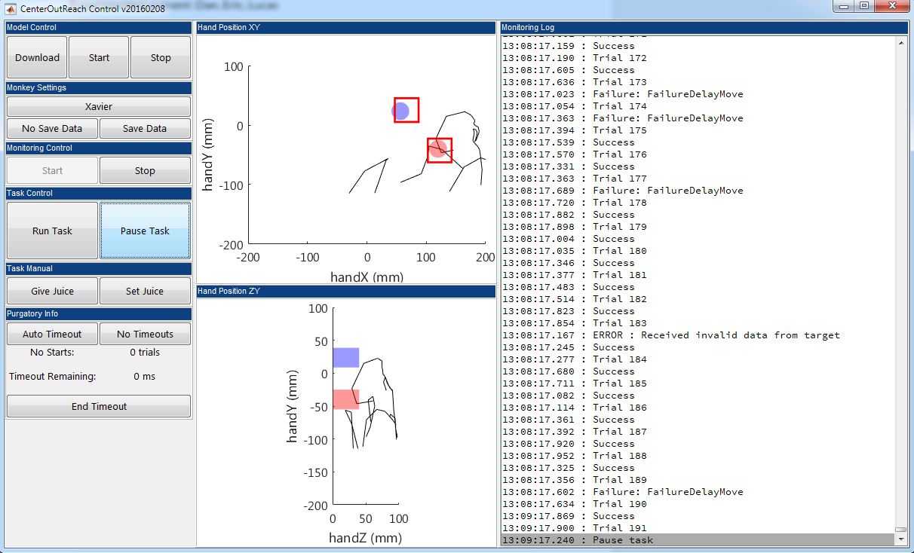

# Code for Optical Brain-Computer-Interface (oBCI) driven by Two-Photon Calcium Imaging

This repo gathers the code required to implement the real-time two-photon imaging driven decoder. This work was described in the manuscript posted at bioRxiv at `biorxiv link`.

This code was authored by Daniel J. O'Shea (c) 2017, in conjunction to be used with an imaging system co-developed with Eric Trautmann and Xulu Sun at Stanford under the guidance of Krishna Shenoy, Karl Deisseroth, and Jim Marshel.

<p align="center">
  


</p>

## Principles of Operation

### Communication with Microscope via PrairieLink and `PrairieSession`

Here, we briefly describe the operation of the system and provide pointers to how to navigate the code. The two-photon microscope that collects the imaging data was built by Bruker Fluorescence Microscopy, and is controlled by the user via their PrairieView software (version 5.4 Alpha, the latest version cerca mid-2017, available either [here](https://pvupdate.blogspot.com/) or from [from Bruker Support](https://pvupdate.blogspot.com/)). We communicate with the microscope via `PrairieLink`, an interface to PrairieView which can be accessed via ActiveX or by sending TCP commands. We use ActiveX only within Matlab for non-realtime purposes, as demonstrated within `matalbPrairieInterface/PrairieControl.m`, using ```actxserver('PrairieLink.Application')``` to connect with PrairieLink. This standalone demonstration shows the images in MATLAB as they are being collected by the microscope.

Separately, the real-time decoder, located within `decoder/`, operates entirely via TCP commands over localhost (i.e. on the same PC as PrairieView is installed on). This low-level communication over TCP to PrairieLink is handled by `CPrairieStream.cpp`, which is C++ code written using the Boost libraries. The class `PrairieStream::PrairieSession` contains a number of low-level methods for connecting to PrairieLink, sending commands, and receiving responses from the PrairieView microscope software. The communication is handled in a way that will timeout gracefully if the PrairieLink socket does not respond in a reasonable amount of time to each request. Several higher level methods are also implemented that execute specific commands in the microscope software, e.g. `sendStartTSeries()` and ``setSavePath(const std::string& path)`.

### Communication and control via UDP from Simulink Real-Time task

While the microscope is imaging, information about the behavioral task required by the decoder will be sent to the microscope computer via a separate UDP socket. This bidirectional communication is handled via the class `PrairieStream::SimulinkUdpHandler`. This class will start a polling thread to listen for received data on the UDP stream, which will be parsed within ```SimulinkUdpHandler.handle_receive(...)```. The contents of the data received from the Simulink task will be used to update the current metadata associated with each frame. This metadata is wrapped by the `PrairieStream::ImageMetadata` class:

```c++
class ImageMetadata
{
public:
  static const int NUM_CONDITIONS = 4;

  unsigned int frameNumber;
  unsigned int trialId;
  unsigned int conditionId;
  bool conditionsToDecode[NUM_CONDITIONS];
  bool usable;
  bool training;
  bool reset;
  unsigned int saveTag;

  unsigned int lines, pixels, samples, channels;

  ...
};
```

This class will also send information back to the Simulink task, which may include the current likelihood estimates from the decoder. This information is wrapped in a `PrairieStream::DecoderUpdate` instance and serialized into the UDP stream via `SimulinkUdpHandler.sendDecoderUpdate(...)`.

```c++
class DecoderUpdate
{
public:
  uint16_t conditionDecoded;
  std::array<double, ImageMetadata::NUM_CONDITIONS> log_likelihoods;
  std::string description;

  ...
};
```

### Establishing a low-latency image stream via `PrairieStream` and `PrairieImageStreamBuffer`

The class `PrairieStream::PrairieStream` uses the communication primitives in `PrairieSession` to establish a low-latency link to microscope's data collection pipeline. This coordinates a streaming session where the microscope software will send imaging samples as soon as they are available. This is orchestrated in `PrairieStream.startStreaming()`, which initializes the streaming process, and `PrairieStream.requestData(...)` which will tell PrairieLink to copy newly available image samples to a specified memory location. New data will be written into a `PrairieStream::PrairieImageStreamBuffer`, which implements as a special purpose ring buffer of image frames. This ring buffer allows new samples (a tuple of intensity values, one for each color channel) to be written consecutively to fill up image frames (a complete image formed by scanning the laser over each line in the field of view). As the image data are being written in, `PrairieImageStreamBuffer` also keeps track of per-frame `ImageMetadata` information. Lastly, `PrairieImageStreamBuffer` also enables collecting image frames off of the buffer (reading the image frames), while also keeping track of which frames have already been read. When reading all frames in order, images can be requested via `PrairieImageStreamBuffer.readImageNextToRead()`. When wishing to access the most recently acquired frame and ignore any queued frames yet to be read, use `PrairieImageStreamBuffer.readImageMostRecentWritten()`. Both of these methods return the image data and metadata wrapped in a `PrairieStream::TaggedImage` instance:

```c++
class TaggedImage
{
public:
  short* image;
  ImageMetadata metadata;

  ...
};
```

### Coordinating microscope communication via `PrairieControl`

The high-level class `PrairieStream::PrairieControl` is ultimately used to coordinate these various pieces. The class will create instances of all of the other required classes, and handle creating, coordinating, and terminating the various polling threads required for decoding. Typically, this class will be used interactively from the Cython interface, described below.

```c++
class PrairieControl
{
public:
  PrairieControl();
  ~PrairieControl();

  bool connect();
  void disconnect();

  int64_t getElapsedMs();
  void setUseTSeries(bool tf);
  bool setSingleImageName(const std::string& name);
  bool setTSeriesName(const std::string& name);
  bool setSavePath(const std::string& path);

  unsigned int getLines();
  unsigned int getPixels();
  unsigned int getSamples();
  unsigned int getChannels();
  void startPolling();
  void stopPolling();
  unsigned int totalFramesWritten();
  void setVerbose(bool tfControl = false, bool tfSession = false, bool tfStream = false, bool tfUdp = false);

  bool hasUnreadImage(bool usableOnly);
  TaggedImage readImageMostRecentWritten(bool usableOnly);
  TaggedImage readImageNextToRead(bool usableOnly);

  bool sendDecoderUpdate(uint16_t conditionDecoded, double* log_likelihoods, unsigned int nConditions, const std::string& desc);

  ImageMetadata getMostRecentMetadata();

private:
  bool connected_;
  bool verbose_;
  std::unique_ptr<boost::asio::io_service> io_service_;
  std::unique_ptr<PrairieStream::PrairieSession> session_;
  std::unique_ptr<PrairieStream::SimulinkUdpHandler> udp_;
  std::unique_ptr<PrairieStream::PrairieDataStream> stream_; // needs to be last since it is passed udp_ and session_
  boost::mutex mutex_;
};
```

### Cython interface to `PrairieControl`

The actual decoding logic is implemented in highly-optimized Python code, implemented via [Cython](https://cython.org/), an optimising static compiler for Python. Using this system enables us to interactively control the microscope via a Cython wrapper around the C++ code. Also, we leverage Cython's [optimized interaction with Numpy arrays](https://cython.readthedocs.io/en/latest/src/userguide/numpy_tutorial.html#numpy-tutorial) and Numpy's ability to treat a pre-allocated block of data as an `ndarray` via [PyArray_SimpleNewFromData](https://docs.scipy.org/doc/numpy/reference/c-api.array.html). This enables us to implement the decoder using efficient Numpy code to work with the imaging data _in situ_ within the `PrairieImageStreamBuffer` without performing any memory copies.

Within Cython, C-style header files will end with the `.pxd` extension, and C-style implementation files will end with the `.pyx` extension. Constants related to decoding are contained within the `constants.pxi` which is used similarly to C-style include file.

To enable interactive control of the microscope and of the decoding toolkit, we wrap the C++ class `PrairieStream::PrairieControl` with a Cython interface within `cyprairistream.pxd` and `cyprairistream.pyx`. The resulting class `cyprairistream.PyPrairieControl` has a very similar interface. `PyPrairieControl` will also return image data and metadata using Cython-wrapped versions of the `TaggedImage` and `ImageMetadata` classes defined in `cyprairistream.pxd`. Also provided is a utility for converting the raw image data pointer within `TaggedImage` to a numpy array (without copying), using the image dimensions defined by the associated `ImageMetadata`.

```cython
cdef np.ndarray[np.int16_t, ndim=4, mode="c"] getTaggedImageAsArray(TaggedImage tagimg):
    cdef int nd = 4;
    cdef np.npy_intp shape[4]
    if tagimg.image == NULL:
        return np.zeros([0, 0, 0, 0], dtype=np.int16)
    else:
        shape[0] = <np.npy_intp> tagimg.metadata.lines
        shape[1] = <np.npy_intp> tagimg.metadata.pixels
        shape[2] = <np.npy_intp> tagimg.metadata.samples
        shape[3] = <np.npy_intp> tagimg.metadata.channels
        return np.PyArray_SimpleNewFromData(nd, shape, np.NPY_INT16, tagimg.image)

```

### Decoding images via Cython `OnlineDecoder`

Finally, we now have the infrastructure in place to write a low-latency image decoder in Cython-compatible Numpy. The logic of implementing the decoder is located in `cydecodelogic.OnlineDecoder`, defined in `cydecodelogic.pxd` and implemented in `cydecodelogic.pyx`. The main operation is implemented by the polling loop in `OnlineDecoder.run()` which will use `PyPrairieControl` to initiate imaging and begin streaming the image data into the ring buffer. While imaging is ongoing, incoming image frames will be processed according to the logic in `OnlineDecoder.poll_images()`. This logic essentially implements a simple state machine that determines, based on the most up to date metadata provided by Simulink over UDP, whether we should be using incoming images to train the decoder or to evaluate the decoder and provide likelihood estimates. It also handles the transition from training to decoding, where any one-time computations should be run that are too time-consuming to run on each incoming training frame. `OnlineDecoder.poll_images()` also handles the logic related to advancing to the next trial (where the accumulated log-likelihood from previous images should be discarded).

The image pre-processing related to training the decoder is implemented in `OnlineDecoder.update_training()`. Here, we average over the multiple samples taken by the microscope at each pixel location, extract the GCaMP channel, flip the orientation of alternating lines of the image (which is related to the back-and-forth scanpath of the resonant decoder), and perform a fast approximation to a Gaussian blur over the image pixels.

```cython
cdef update_training(self, TaggedImage tagImage):
      cdef np.int16_t[:,:,:,:] raw_samples = getTaggedImageAsArray(tagImage) # wrap in 4-D numpy array
      flip_lines_and_sum_samples(raw_samples, self.this_frame)  # sum over samples for green frame

      self.has_seen_training_images = True
      self.frame_count += 1

      # blur frame into smoothed_frame (will also modify thisFrame)
      gaussian_blur(self.this_frame, self.smoothed_frame, self.box_sizes, False)

      # send frame to decoder
      self.decoder.process_training_image(self.smoothed_frame, tagImage.metadata.conditionId-1)
```

Similarly, during decoding, we perform a similar pre-preocessing pipeline and ask the decoder to return updated log-likelihood estimates for each possible condition given this new frame and previous frames this trial.

```cython
cdef update_decode(self, TaggedImage tagImage):
      self.frame_count += 1

      cdef np.int16_t[:,:,:,:] raw_samples = getTaggedImageAsArray(tagImage)
      flip_lines_and_sum_samples(raw_samples, self.this_frame)  # sum over samples for green frame

      # blur frame into smoothed_frame (will also modify thisFrame)
      gaussian_blur(self.this_frame, self.smoothed_frame, self.box_sizes, False)

      # ask decoder for log_likeihoods for each condition
      self.log_likelihoods = self.decoder.decode_test_image(self.smoothed_frame)
```

Our straightforward implementation of a minimum squared error decoder is equivalent to performing maximum-likelihood estimation with a Gaussian noise model, and is implemented in `cydecoder.MSEDecoder`. It would be straightforward to implement a new decoder using the same interface:

```cython
cdef class MSEDecoder:
    def __cinit__(self, lines, pixels)
    cdef void process_training_image(self, double[:,:] image, unsigned int condition_id)
    cdef post_training(self)
    cdef reset_new_trial(self)
    cdef double[:] decode_test_image(self, double[:,:] image)
    cdef reset(self)
```

### Running the decoder

Typically, we run the decoder from an interactive iPython shell, using a sequence of commands similar to those included in `run_online_decoder.py`. The commented lines enable control over the verbosity of printed information, which is also timestamped and logged to disk. Some verbose info is useful for debugging but can slow the operation of the real-time decoder.


```python
from cydecodelogic import OnlineDecoder
from cyprairiestream import PyPrairieControl
from datetime import datetime

useTSeries = True

if 'pc' not in locals():
    pc = PyPrairieControl()

# pc.setVerbose(stream=True, udp=True)
# pc.setVerbose(udp=True)

if not pc.connect():
    raise RuntimeError("couldn't connect")

try:
    pc.setUseTSeries(useTSeries)

    od = OnlineDecoder(pc)
    od.run()

except Exception as exc:
    pc.stopPolling()
    raise exc

finally:
     pc.stopPolling()
```

Here is a screenshot of our microscope computer at the end of a decoding session. The imaged dendrites are visible in green in the top-right window, synchronization signals in the oscilloscope-style traces in the "Voltage Recording" window, and the decoder shell in the bottom right terminal. A `matplotlib` figure produced by the decoder at the end of training is visible in the background.


### Implementing task logic in Simulink Real-time

The microscope interface code and low-latency Cython decoder are somewhat standalone, in that all interactions with the reaching task logic are handled via a bi-directional UDP link, which provides task information necessary to interpret each frame and allows decoder estimates to inform the task progression. We also include the Simulink Real-Time model and associated code as an illustration of how this might be implemented. However, it is unlikely that this model would be used as is for a new implementation of a reaching system. Getting this up and running would require a considerable amount of effort to adapt the code to specific rig hardware and task requirements. Here, we use Simulink Real-Time, in which a model specified using Simulink and MATLAB code is translated into C and transcompiled into a standalone executable that runs on a reduced Simulink Real-time operating system, running on a separate computer. In this way, we achieve hard real-time control of the task logic. There is also a separate computer running PsychToolbox3 for the task display controlled via UDP, and a data logging computer which receives task data via UDP regarding the task and behavior which it saves to disk. This behavioral data stream can later be combined with the imaging data saved locally by the microscopy computer for offline analysis, with synchronization enabled by shared `trial-start` TTL pulses and a serialized `trial-info` binary signal converying ASCII strings at the start of each trial.

In our model, the task control is broken into 4 submodules, linked in as Simulink reference models to speed up compilation. These models handle:
* RigInput: inputs from rig hardware and from UDP ports
* Task: task logic and condition selection implemented primarily in StateFlow
* TaskOutput: serialization of outputs to send via network and output lines
* RigOutput: outputs to rig hardware and to UDP ports

There is also a separate output link which serializes data to be sent to the "host" computer, the Windows PC running MATLAB where the task will be controlled from. This powers the GUI used to control and monitor the task. The code and `SLX` model file for the task is located within `'CenterOutReach/v20170705`. There is also a block which specifies the configuration of the various "scopes" on the Simulink Real-Time computer display screen.


The primary task logic is implemented in Stateflow, a graphical environment for specifying state machines. Here each trial progresses clockwise around the loop to the `Success` state, unless a failure condition is encountered. Within this task logic, metadata needed by the decoder is updated which indicates when certain frames should be considered for decoding (after the go cue is delivered, for `Tint` ms, see Methods in the manuscript).


Lastly, we controlled the Simulink Real-Time model, and through it, the operation of the decoding system and the microscope data streaming, via a GUI. The GUI also received serialized data about each trial including live hand position from the model, also over UDP. This code is located in 'CenterOutReach/v20170705/gui'.



## Using the code

To use the PrairieControl code, you would need to have PrarieView installed and the PrairieLink DLL registered on your microscope PC. It is possible that the API for PrairieLink may have changed in recent versions requiring changes to the C++ code that interfaces with it. This code was developed largely within Visual Studio, so you can get started by opening the solution file `PrairieLinkBoost.sln`. To build the Cython code, look at `decoder/setup.py`, which includes instructions in the comments at the top of the file. You will need to have built the boost libraries using the Visual Studio toolkit on your PC (easiest from within the VS developer prompt), and then to build the Cython interface from within the Anaconda shell after running the `vcvars32.bat` script as indicated.

As noted above, it is unlikely that you would want to reuse the Simulink Real-Time model, but if you do wish to open the model and look around, you will need to download the [MatUDP toolkit](https://github.com/djoshea/matudp) I've developed and to add its `simulink` folder to the MATLAB path. MatUDP handles the automatic serialization and deserialization of bus types used heavily within the CenterOutReach model, and also includes the automatic trial data logger and UDP-controlled PsychToolbox3 interface the task uses.

Hope you find this helpful!
Dan
